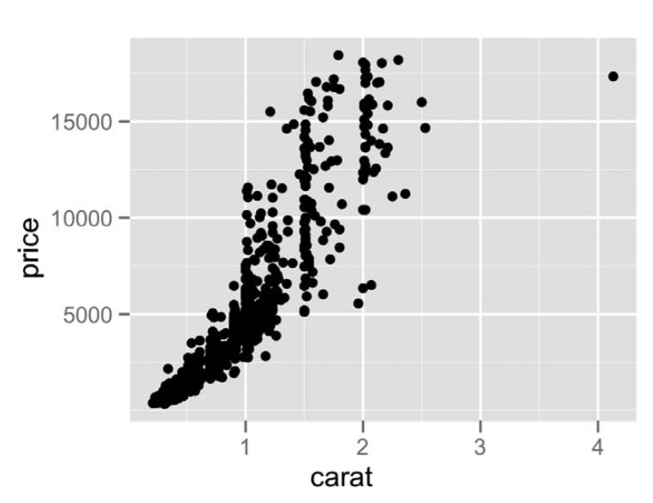
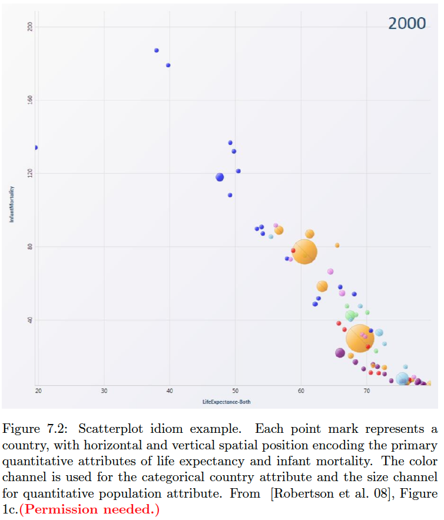

# Idiom-Mark-Data-Encode Table Examples

This page presents several examples of naming the idiom, mark, data attribute, data type, and encoding channel for different types of idioms. I'll ask you to describe your charts using these "idiom/mark/data/encode tables" in HW assignments and on the mid-term exam.

## Scatterplot 1

<a href="fig7.3a.png">Figure 7.3a</a>

Idiom: Scatterplot / Mark: Point
| Data: Attribute | Data: Attribute Type  | Encode: Channel | 
| --- |---| --- |
| carat | value, quantitative | horizontal spatial position (x-axis) |
| price | value, quantitative | vertical spatial position  (y-axis) |

## Scatterplot 2

This example is sometimes called a "bubble chart" because it encodes data with size, so that points look like bubbles.

<a href="fig7.2.png">Figure 7.2</a>

Idiom: Scatterplot / Mark: Point
| Data: Attribute | Data: Attribute Type  | Encode: Channel | 
| --- |---| --- |
| life expectancy | value, quantitative | horizontal spatial position (x-axis) |
| infant mortality | value, quantitative | vertical spatial position  (y-axis) |
| country | categorical | color hue |
| population | quantitative | size |

## Bar Chart

<a href="https://www.cs.ubc.ca/~tmm/vadbook/eamonn-figs/fig7.4b.pdf">Figure 7.4b</a>

Idiom: Bar Chart / Mark: Line
| Data: Attribute | Data: Attribute Type  | Encode: Channel | 
| --- |---| --- |
| animal type | key, categorical | separate, horizontal position (x-axis) |
| avg weight | value, quantitative | aligned vertical position (y-axis) |

## Line Chart

<a href="https://www.cs.ubc.ca/~tmm/vadbook/eamonn-figs/fig7.8b.pdf">Figure 7.8b</a>

Idiom: Line Chart / Mark: Points with connection marks
| Data: Attribute | Data: Attribute Type  | Encode: Channel | 
| --- |---| --- |
| year| key, ordered | separate, horizontal position (x-axis) |
| cat weight | value, quantitative | aligned vertical position (y-axis) |

## Grouped Bar Chart

<a href="https://www.cs.ubc.ca/~tmm/vadbook/eamonn-figs/fig12.8a.pdf">Figure 12.8a</a>

Idiom: Grouped Bar Chart / Mark: Line
| Data: Attribute | Data: Attribute Type  | Encode: Channel | 
| --- |---| --- |
| state | primary key, categorical | outer horizontal spatial region (x-axis) |
| age group | secondary key, categorial/ordered | inner horizontal spatial region (x-axis) |
| population | value, quantitative | aligned vertical position (y-axis) |
| age group | categorical/ordered | color hue |

